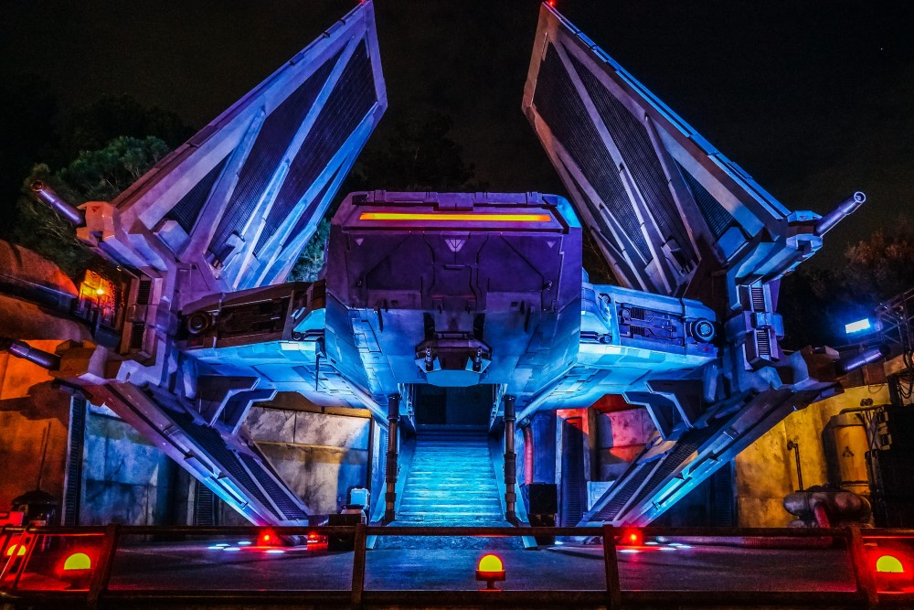

# redis-spaceship
A Redis-powered spaceship

## Introduction

This is the example application for the upcoming book _Planet of the
Redis Lords_ from [Spellbook Press](https://spellbookpress.com).

## Synopsis

You, along with small crew of scientists, were traveling through hyperspace
on a mission of discovery when your RelationalDrive failed, knocking your
ship _Emissary_ off trajectory.

In the ensuing chaos, you crash-landed on an uncharted planet. The crash
destroyed most of your ship, including the thrusters, main drive, piloting
AI, security system, storage deck, and more -- leaving you with only the main
housing compartment and a small land rover intact.

Your mission now?

This planet glitters with signs of advanced technology. Trade with the beings
who live here in order to reassemble your ship, reach escape velocity, and
return to join the Fleet.

Judging by the level of technology on this planet, the ship you leave
with will be even more advanced than the one you destroyed...

